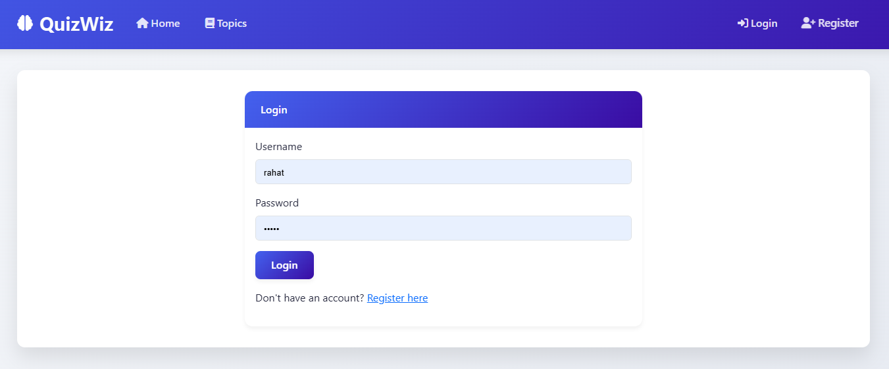

# QuizWiz — Flask-Powered Quiz App

A clean, full-featured quiz application built with Flask. Pick a topic (Science, Technology, History), play four levels with 10 questions each, race against a 30-second timer per question, and see detailed reports after each level. Anonymous play is supported; registered users can track their history and analytics.

## Tech Stack & Concepts
- Python, Flask, Jinja2
- Flask-SQLAlchemy (ORM) + SQLite
- Flask-Login (authentication, sessions)
- Blueprints, Application Factory pattern
- Bootstrap 5 (UI) + Vanilla JavaScript (timer, client interactions)
- JSON-based question bank
- Core concepts: routing, templates, DB modeling, auth, session management

## Features
- Play as guest, or register/login to save progress and analytics
- Topics: Science, Technology, History
- 4 levels per quiz, 10 questions each (total 40)
- Scoring:
  - Correct: full points
  - Wrong: negative marking (−50% of the question’s points)
  - Skipped/timed-out: 0 points (no penalty)
- Passing rule: earn at least 60% of the level’s total possible points
- 1 correct + 7 distractor options per question; show 4 options including the correct one (shuffled)
- Skip button
- Detailed per-level report (question text, shown options, your choice, correctness, and points)
- User history table with “Detailed View” per attempt; winners (cleared all 4 levels) highlighted
- Admin view to see all attempts
- Refresh protection: refreshing ends the current quiz and returns to the landing page

## Screenshots

### Landing Page
  
Entry point to start a quiz or view progress (when logged in).

### Choose Topic
  
Select Science, Technology, or History to begin.

### Register
  
Create an account to save attempts and view analytics; first user is admin (demo).

### Login
  
Secure login via Flask-Login.

### Question View
  
Each question has a 30s timer, 4 shuffled options (always includes the correct one), and a Skip button.

### Level Complete
  
See pass/fail based on points (60% threshold), score summary, and a detailed per-question report.

### Profile / History
  
Review previous attempts in a table with status badges and drill down to see full details.

### Quiz Complete (Win)
  
Shown after clearing all 4 levels; “Winner” attempts are highlighted in history.